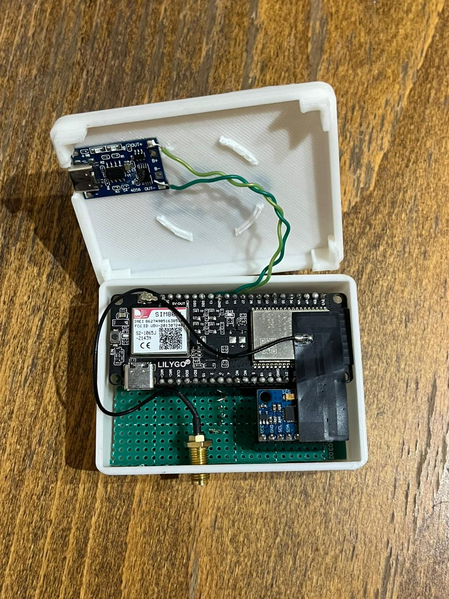
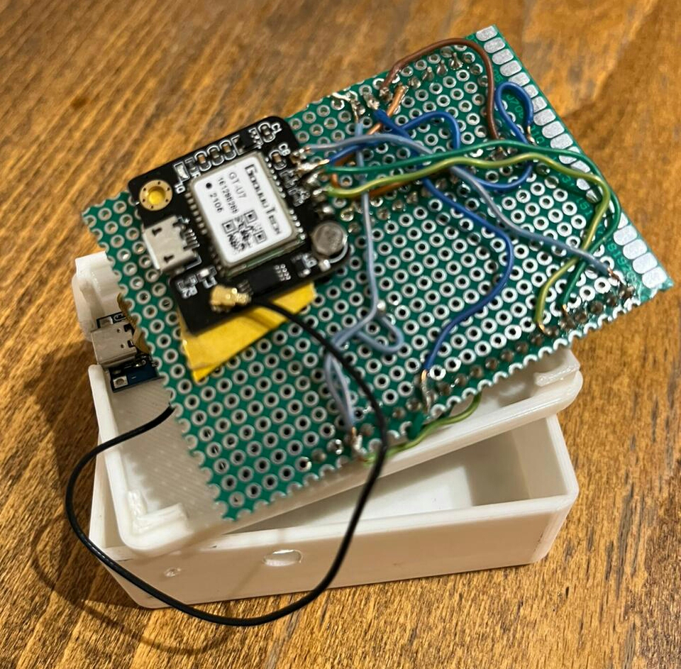
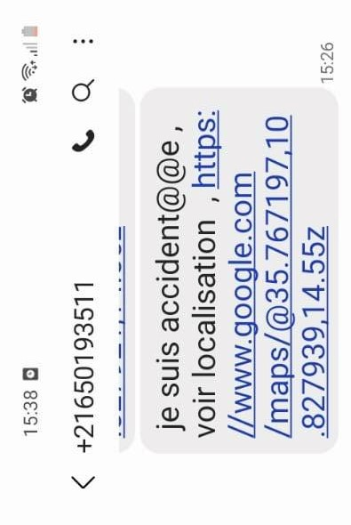

# Road Accident Detection & Emergency Alert System

An **IoT-based road safety system** designed to automatically detect a possible vehicle accident, retrieve the GPS location, and send an emergency SMS alert to a predefined contact.

The system combines an **ESP32 LILYGO TTGO**, **SIM800L GSM module**, **accelerometer**, **GPS**, and a **Flutter mobile application**.

---

## Project Overview

The objective of this project is to reduce emergency response time after a road accident.

An accelerometer continuously monitors the movement of the system. When a strong impact or abnormal vibration is detected, the ESP32 processes the event, retrieves the current GPS position and sends an emergency SMS through the SIM800L module.

The SMS contains a **Google Maps location link**, allowing the emergency contact to quickly identify the accident location.

The system also includes a Flutter mobile application used to manage user and medical information.

---

## Technologies


---

## Main Features

* Automatic accident / strong-impact detection
* Accelerometer-based vibration monitoring
* GPS location acquisition
* GSM/GPRS communication
* Emergency SMS notification
* Google Maps location sharing
* ESP32-based embedded system
* Flutter mobile application
* User and medical information management
* Compact hardware prototype

---

# Hardware Prototype

## Complete Device

<p align="center">
  
</p>

The embedded system is integrated inside a custom enclosure designed to contain and protect the hardware components.

---

## Accident Detection Hardware

<p align="center">
  
</p>

The prototype integrates the embedded controller, sensors and communication modules required for accident detection and emergency notification.

The **accelerometer** is responsible for monitoring vibration and sudden movement that may indicate an accident.

---

## GPS System

<p align="center">
  
</p>

The GPS module provides the geographical coordinates of the vehicle.

When an accident is detected, these coordinates are used to generate a location that can be shared with the emergency contact.

---

# Mobile Application

A **Flutter mobile application** was developed as part of the system.

The application allows the user to manage information that may be useful during an emergency, such as:

* Name
* Gender
* Blood group
* Height
* Weight
* Medical information / chronic conditions

The mobile application was developed using **Flutter and Dart**.

---

# Emergency SMS Alert

<p align="center">
  
</p>

When an accident is detected, the **SIM800L GSM module** sends an emergency SMS.

The message contains a **Google Maps location link** generated from the GPS coordinates.

This allows the emergency contact to immediately open the accident position on a map.

---

# System Architecture

```text
                    Vehicle Movement
                          │
                          ▼
                    Accelerometer
                          │
                    Impact Detection
                          │
                          ▼
                 ESP32 LILYGO TTGO
                          │
              ┌───────────┴───────────┐
              │                       │
              ▼                       ▼
         GPS Module              SIM800L
              │                       │
      Latitude / Longitude            │
              │                       │
              └───────────┬───────────┘
                          │
                          ▼
                 Emergency SMS
                          │
                          ▼
                Google Maps Link
                          │
                          ▼
                 Emergency Contact


                  Flutter Mobile App
                          │
                          ▼
              User / Medical Profile
```

---

# How It Works

### 1. Monitoring

The accelerometer continuously monitors the movement and vibration of the system.

### 2. Accident Detection

A strong impact or abnormal vibration is detected and processed as a possible accident event.

### 3. Location Acquisition

The GPS module retrieves the current geographical coordinates.

### 4. Emergency Communication

The ESP32 communicates with the **SIM800L GSM module**.

### 5. SMS Generation

An emergency message containing the location information is generated.

### 6. Alert Transmission

The SIM800L sends the SMS to the predefined emergency contact.

### 7. Location Access

The recipient can open the included **Google Maps link** to locate the accident.

---

# Hardware

| Component             | Purpose                                        |
| --------------------- | ---------------------------------------------- |
| **ESP32 LILYGO TTGO** | Main embedded controller                       |
| **SIM800L**           | GSM/GPRS communication and SMS transmission    |
| **Accelerometer**     | Detects vibration and sudden impact            |
| **GPS Module**        | Retrieves accident location                    |
| **Antenna**           | Supports wireless communication                |
| **Custom Enclosure**  | Protects and integrates the prototype hardware |

---

# Software

| Technology               | Purpose                              |
| ------------------------ | ------------------------------------ |
| **Embedded C / Arduino** | Embedded firmware                    |
| **ESP32**                | Sensor processing and system control |
| **Flutter**              | Mobile application                   |
| **Dart**                 | Mobile application programming       |
| **GPS**                  | Location acquisition                 |
| **GSM / SMS**            | Emergency communication              |

---

# Skills Demonstrated


---

# What I Learned

Through this project, I gained practical experience in:

* Integrating sensors with an ESP32-based embedded system
* Working with accelerometer data for event detection
* Interfacing GPS hardware with an embedded controller
* Working with GSM/GPRS communication
* Sending SMS messages using SIM800L
* Generating location-based emergency alerts
* Connecting embedded hardware with a mobile application
* Developing mobile interfaces using Flutter and Dart
* Hardware prototyping and system integration
* Testing an end-to-end IoT application

---

# Future Improvements

* Improve accident detection algorithms to reduce false positives
* Add an alert cancellation period before sending the SMS
* Send notifications to multiple emergency contacts
* Add cloud event storage
* Add accident history to the mobile application
* Add real-time vehicle tracking
* Improve power management
* Improve hardware enclosure and PCB integration

---

# Author

**Wiem Chebbi**

Embedded Software Engineer
